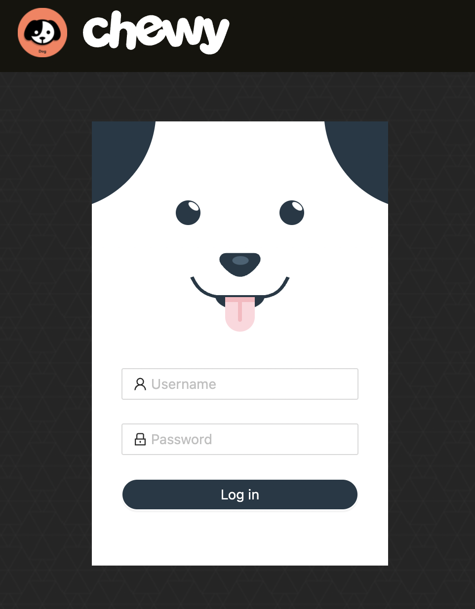

<div id="top"></div>  
<details>  
  <summary>Table of Contents</summary>  
  <ol>  
   <li>  
      <a href="#download">Download</a>  
      <ul>  
         <li><a href="#prerequisites">Prerequisites</a></li>  
         <li><a href="#clone">Clone</a></li>  
        <li><a href="#use">Use</a></li>  
      </ul>  
   </li>  
    <li>  
      <a href="#about">About</a>  
      <ul>  
        <li><a href="#login-page">Login Page</a></li>  
      </ul>  
    </li>  
  </ol>  
</details>  


<!-- DOWNLOAD -->  

## Download

You can either left click green button "Code" to download the zip file or clone the repository as following steps.

### Prerequisites

<a href="https://nodejs.org/en/">_Node.js_</a>

### Clone

Clone the repo

 ```sh 
 git clone https://github.com/Inupedia/eCommerce-Platform.git  
 ```  

### Use

 ```
 sh npm install --dependencies  
 ```  

 ```
 sh npm start  
 ```  

<p align="right">(<a href="#top">back to top</a>)</p>  


<!-- ABOUT THE PROJECT -->  

## About

### Login Page

<p align="center"></p>
<p align="right">(<a href="#top">back to top</a>)</p>